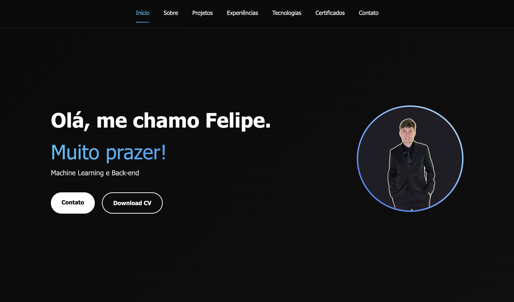

<h1 align="center">
  💻 Meu Portfólio
</h1>

  

  <a href="https://feliperodighero.github.io/portfolio/" target="_blank">🌐 Clique para visitar o projeto</a>

---

## 📌 Seções

Este portfólio é composto por sete seções principais:

- **Início:** Breve apresentação, com botões para baixar o currículo e entrar em contato;
- **Sobre:** Uma descrição falando um pouco sobre mim;
- **Projetos:** Lista com alguns projetos desenvolvidos, com links para os repositórios no GitHub;
- **Experiências:** Informações sobre minhas experiências profissionais e responsabilidades;
- **Tecnologias:** Tecnologias com as quais tenho familiaridade;
- **Certificados:** Carrossel com fotos dos meus certificados;
- **Contato:** Formulário para envio de e-mail, redes sociais e endereço de e-mail.

---

## 💼 Tecnologias utilizadas

O portfólio foi desenvolvido com as seguintes tecnologias:

- HTML5
- CSS3
- JavaScript

---

## 🧑‍💻 Autor

<table>
  <tr>
    <td align="center">
      <a href="https://github.com/feliperodighero">
         
        <b>Felipe Rodighero</b>
      </a>
    </td>
  </tr>
</table>

---

## 📬 Entre em contato

Você pode me encontrar em:

- 💼 [LinkedIn](https://www.linkedin.com/in/felipe-rodighero-9a0ab8274/)
- 📧 [feliperzarichta@gmail.com](mailto:feliperzarichta@gmail.com)
